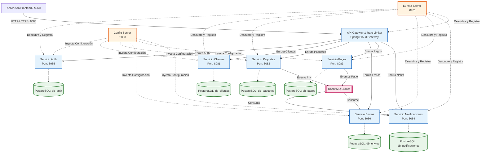
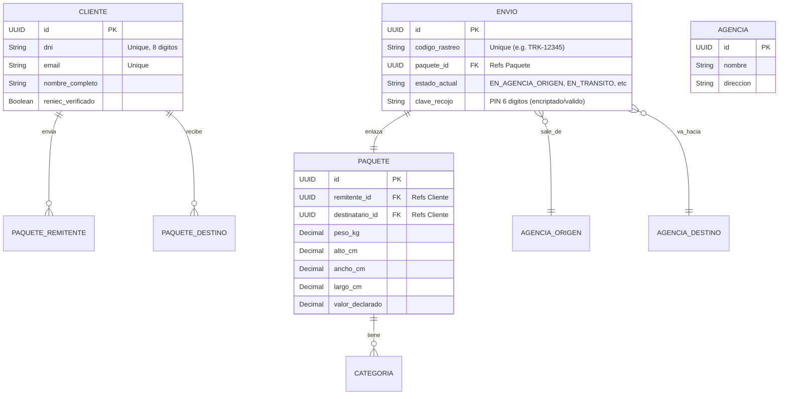

# RapidoCourier - Backend Architecture Documentation

Este documento está diseñado para proporcionar a los equipos de **Frontend** y **Nuevos Desarrolladores Backend** todo el contexto técnico, endpoints y diagramas necesarios para integrarse exitosamente al ecosistema de microservicios de RapidoCourier.

---

## 1. Stack Tecnológico

El backend sigue una arquitectura moderna orientada a **Microservicios (Spring Cloud)**.

*   **Lenguaje y Framework:** Java 21, Spring Boot 3.5.x
*   **Orquestación de Servicios:** Spring Cloud Netflix Eureka (Service Discovery)
*   **Gestión de Configuración:** Spring Cloud Config Server (Repositorio centralizado de `.yaml`)
*   **API Gateway:** Spring Cloud Gateway (Manejo de rutas, rate-limiting, y validación JWT de primer nivel)
*   **Base de Datos:** PostgreSQL 15 (Cada microservicio tiene su base de datos independiente `db_clientes`, `db_envios`, etc.)
*   **Mensajería Asíncrona:** RabbitMQ (Event-driven para notificaciones y pagos)
*   **Caché y Rate-Limiting:** Redis (Integrado en Gateway)
*   **Migraciones DB:** Flyway (Aplicado con `ddl-auto: validate`)
*   **Despliegue:** Docker Compose

---

## 2. Diagrama de Arquitectura de Microservicios

El siguiente diagrama muestra el flujo de las peticiones desde el cliente hacia los microservicios.

---

## 3. Modelo de Dominio (Event-Driven & API)

El sistema funciona emulando una empresa de envíos donde el proceso de registro de clientes está abstraído o flexibilizado ("Tipo Shalom").
*   Cuando un remitente va a caja, se puede buscar por DNI o crear al vuelo (servicio de clientes).
*   Se crea un `Paquete`, lo cual asigna automáticamente peso, medidas y categoría. Al crearse el paquete, **RabbitMQ** dispara el evento `PAQUETE_PIN`.
*   El **Servicio de Notificaciones** escucha dicho evento y envía un código PIN seguro (de 6 dígitos) al email del destinatario para que pueda reclamar el paquete.
*   Luego se genera un `Envio` que enlaza el paquete con la Agencia Origen y Agencia Destino.

---

## 4. Referencia de Endpoints del API Gateway (`http://localhost:8080`)

Para el Frontend, **todas las peticiones deben dirigirse al Gateway por el puerto 8080**. El gateway incluye validación JWT (requiere header `Authorization: Bearer <token>`) y rate limiting (Redis).

> [!TIP]
> Recuerda enviar siempre tus requests a `http://localhost:8080/api/v1/...`
> El Gateway quitará el prefijo automáticamente y enrutará la petición al microservicio que corresponda.

### Auth (`servicio-auth`)
*   `POST /api/v1/auth/login` - Autenticación estándar y obtención de JWT.
*   `POST /api/v1/auth/otp/send` - Enviar código OTP.
*   `GET /api/v1/usuarios/...` - Gestión de usuarios del sistema.

### Clientes (`servicio-clientes`)
*   `GET /api/v1/clientes/...` - Buscar clientes (ej: por DNI, para rellenar formulario rápido en el mostrador).
*   `POST /api/v1/clientes/...` - Crear o actualizar un cliente.

### Paquetes (`servicio-paquetes`)
*   `GET /api/v1/paquetes/...` - Listar paquetes.
*   `POST /api/v1/paquetes/...` - Registrar nuevo paquete (Dispara evento `PAQUETE_PIN` vía RabbitMQ).
*   `GET /api/v1/categorias/...` - Listar categorías de empaque.

### Envíos (`servicio-envios`)
*   `POST /api/v1/envios/...` - Generar la guía de envío a partir del paquete.
*   `GET /api/v1/envios/rastreo/{codigo}` - Seguimiento público de un código de rastreo.
*   `GET /api/v1/agencias/...` - Listar sucursales o agencias disponibles para destino.

### Pagos y Notificaciones
*   `POST /api/v1/pagos/...` - Pasarela de pago o confirmación de caja.
*   `GET /api/v1/notificaciones/...` - (Uso interno o dashboard administrativo).
